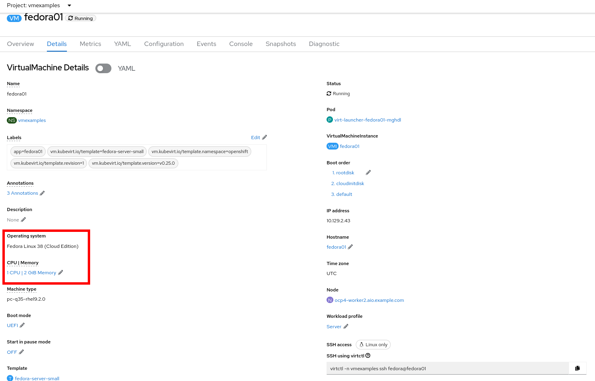
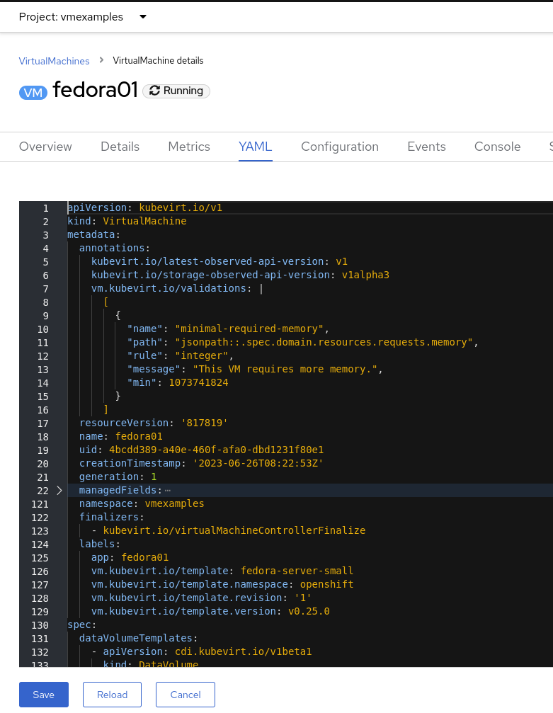
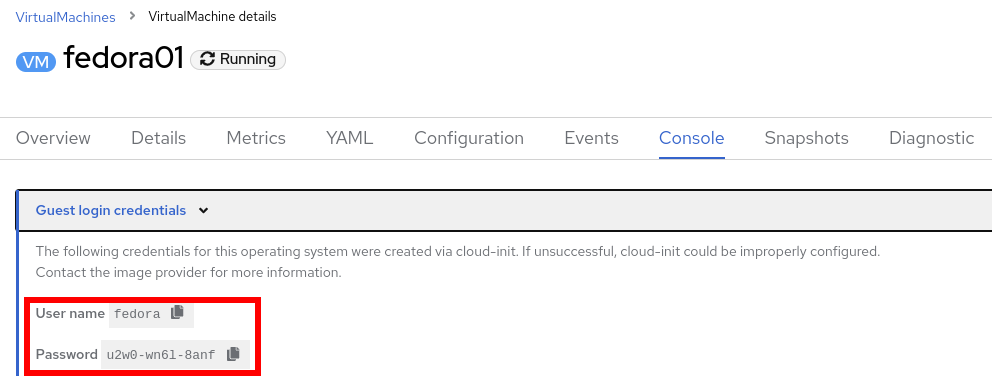
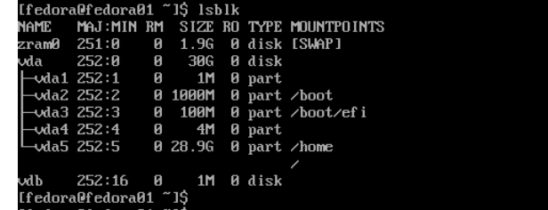
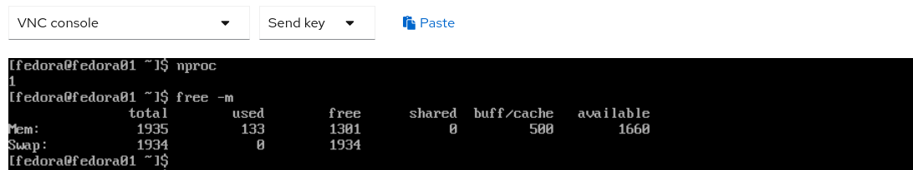

:scrollbar:
:toc2:

== VM Creation and Administration with Web Console Lab

:numbered:

== Introduction to Creation and Administration of VMs

In this lab, you become familiar with running virtual machines (VMs) on Red Hat^(R)^ OpenShift^(R)^ Container Platform. You create a new virtual machine based on a bootable operating system PVC provided by the Operator.

.Goals
* Create a new virtual machine
* Access the VM console
* Gain experience using the VM console

== Overview

OpenShift Virtualization includes an overview dashboard to review the status and he inventory information.

. From the left menu, navigate to *Virtualization* -> *Overview*:
+

== Create New VM

. From the left menu, navigate to *Virtualization* -> *VirtualMachines*:
+
image::images/Create_VM_PVC/01_Left_Menu.png[]
+
[NOTE]
====
The *Virtualization* tab is available only when Red Hat OpenShift Virtualization is installed and properly configured.
====

. Examine the *Virtual Machines* dashboard that appears, currently empty because no VMs exists:
+
image::images/Create_VM_PVC/02_OCP_Virt_Dashboard.png[]

. Before you create a VM, create a new project:
.. Click *Project: All Projects* and then click *Create Project*.
.. In the *Name* field, type `vmexamples` to name the project, then click *Create*.
+
image::images/Create_VM_PVC/03_Create_Project.png[]

. Click *Create VirtualMachine*, and expect a dashboard to appear showing the available pre-defined templates:
+
image::images/Create_VM_PVC/04_Create_VM_Templates.png[]
+
The templates with an already configured PVC are marked in blue with `Source available`.

. Select the *Fedora VM* tile and a dialog opens.
+
image::images/Create_VM_PVC/05_Create_VM_Quick.png[]

. Change the name to `fedora01` and press *Quick create VirtualMachine*:
+
image::images/Create_VM_PVC/05_Create_VM_Quick_Name.png[]

+
. After a few minutes, expect to see that the VM is `Running`.
+
image::images/Create_VM_PVC/06_Fedora_Running.png[]

. After the VM is created, examine the *Events* tabs:
+
image::images/Create_VM_PVC/09_Fedora_Events.png[]
+
* A DataVolume is created.
* The VM is started.

. Click the *Details* tab to obtain information related to the VM:
+

+
As with other resources in OpenShift, a VM is defined using a YAML manifest.

. Click the *YAML* tab to show the definition:
+

== Access Virtual Machine Console

. Click the *Console* tab to access the VM's console:
+
image::images/Create_VM_PVC/13_Fedora_Console.png[]

. Click *Guest login credentials* to see the password generated for the `fedora` user:
+

. Log in to the VM using the `fedora` user and the indicated password.
+
[IMPORTANT]
Unfortunately it is not possible to copy and paste the password to the terminal.
+
[IMPORTANT]
The console input is using US keymap. One small trick is to write in the login the password to ensure the characters (specially the `-` is correct).

. After you log in, run the `ip a` command to display the interfaces and IP addresses:
+
image::images/Create_VM_PVC/15_Fedora_Network.png[]
+
The IP address assigned is an internal IP address used for the KVM and is not the accessible IP.

. Run `lsblk` to display the list of disks and their capacities and free space:
+

+
* `/dev/vda` is the disk created during the VM creation and the size specified at creation time.
* `/dev/vdb` is used for `cloud-init` required data (for example, to configure the `fedora` user password).

. Examine the number of CPUs and amount of memory associated with the VM (which match the `flavor` specified during creation), using the `nproc` and `free -m` commands:
+

. Mount the `cloud-init` disk:
+
image::images/Create_VM_PVC/21_Fedora01_Cloud_Init.png[]

. Click the *Overview* tab to show the information obtained from the guest VM:
+
image::images/Create_VM_PVC/19_Fedora_Agent_Details.png[]
+
* Hostname
* Operating system version and timezone information
* Active users
* Utilization: CPU, Memory, Storage and Network.

== Examine Resources Associated with VM

. Examine the network interfaces attached to the VM:
+
image::images/Create_VM_PVC/20_Network_Tab.png[]
+
When a VM is created, an interface in the `PodNetworking` network of type `masquerade` is created by default. This provides access from the VM to outside the OpenShift Cluster and allows the other VMs and Pods from the same namespace to access the VM.

. List the disks associated with the VM:
+
image::images/Create_VM_PVC/21_Disks_Tab.png[]
+
In this environment, the default StorageClass is called `ocs-storagecluster-ceph-rbd`.

== Summary

In this lab, you created a VM using a pre-configured PVC provided by the Operator.

You may continue to the next lab, _Virtual Machine Container Lab_, where you create a VM based on a disk in a container, work with snapshots, and resize the VM.
