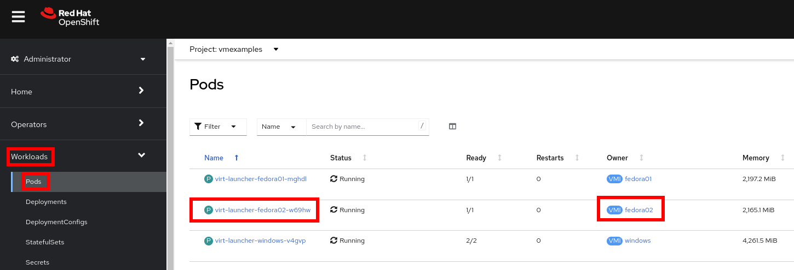
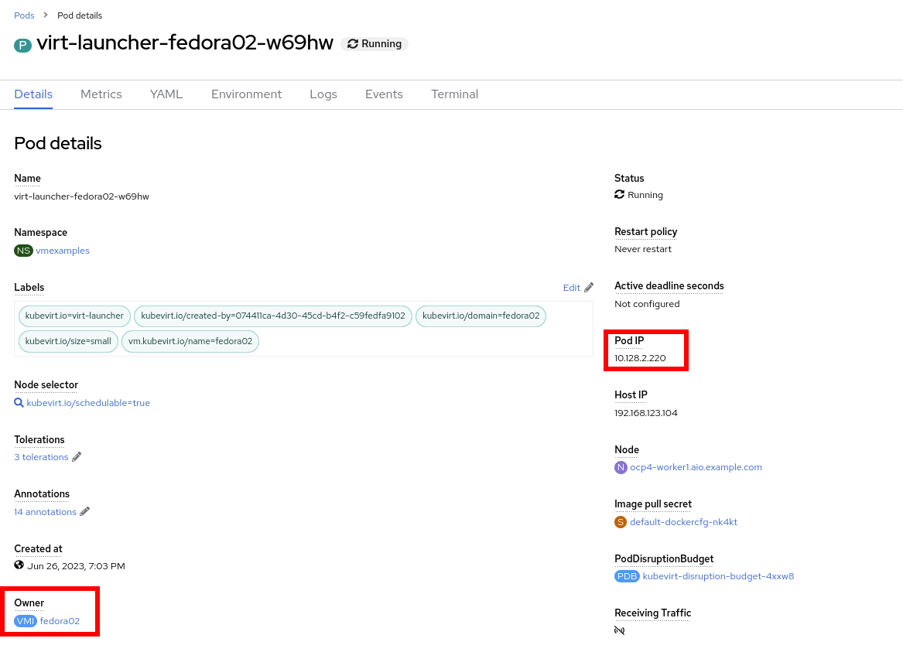
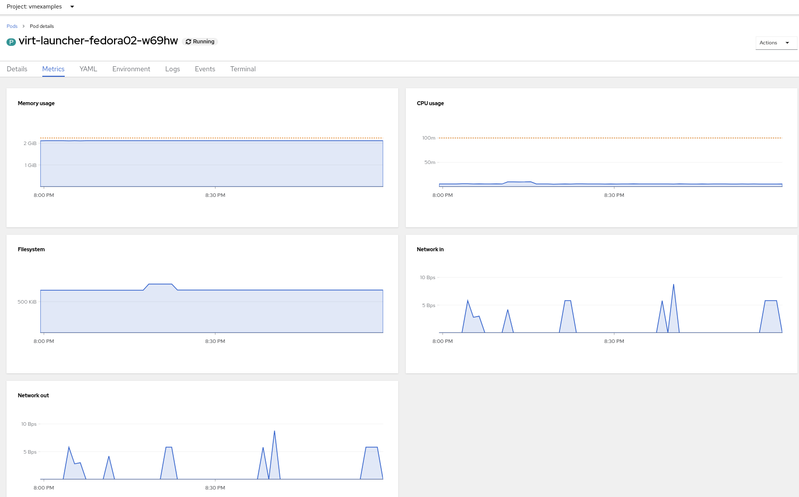
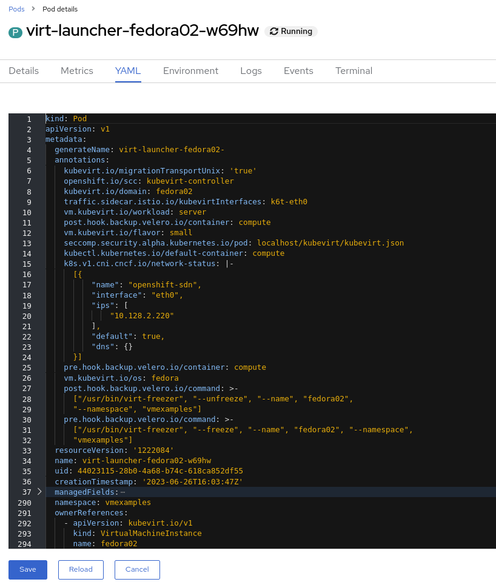
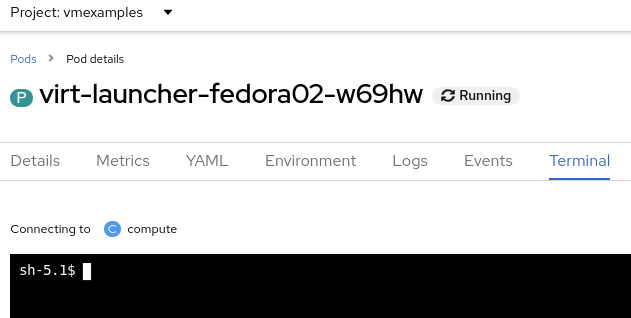

:scrollbar:
:toc2:

== Pod and Virtual Machine Migration Lab

:numbered:

== Introduction to Pod and Virtual Machine Migration

In this lab, you explore the Pods associated with the virtual machine (VM) and you run commands inside the container to explore the associated storage and network.
Finally, you run a migration test on the VM that you previously created to watch it move from one worker node to another without shutting down (live migration).

.Goals
* Examine the Pods associated with a VM
* Gain experience with live migration

== Explore Pods Related to Virtual Machine

. In the Red Hat^(R)^ OpenShift^(R)^ Container Platform web console, navigate to *Workloads* -> *Pods* and expect to see a list of the Pods associated with this VM:
+

. Select the Pod prefixed with `virt-launcher-fedora02-`.

. Review the information shown on the *Details* tab--especially the information included for *Owner* and *Pod IP*:
+

+
The IP address corresponds to the VM's IP address.

. Scroll down further to see information about the containers in the Pod:
+
image::images/Pods_Migration/11_Pod_Details_2.png[]
+
The VM is to run inside `compute` container.

. Navigate to *Metrics* tab to see what metrics are available:
+

. Navigate to the *YAML* tab and review the Pod definition:
+

. Navigate to the *Events* tab and review the actions performed:
+
image::images/Pods_Migration/13_Pod_Events.png[]

. Navigate to the *Terminal* tab and see that you can connect to the container:
+

. Using the `virsh` application, list the VMs:
+
[source,sh]
----
sh-4.4# virsh list
----
+
.Sample Output
[source,texinfo]
----
 Id   Name                  State
-------------------------------------
 1    vmexamples_fedora02   running
----

. List the disks associated with the VM:
+
[source,sh]
----
sh-4.4# virsh domblklist 1
----
+
.Sample Output
[source,texinfo]
----
 Target   Source
---------------------------------------------------------------------------------------------
 Target   Source
---------------------------------------------------------------------------------------------
 vda      /dev/rootdisk
 vdb      /var/run/kubevirt-ephemeral-disks/cloud-init-data/vmexamples/fedora02/noCloud.iso
----

. List the network interface associated with the VM:
+
[source,sh]
----
sh-4.4# virsh domiflist 1
----
+
.Sample Output
[source,texinfo]
----
 Interface   Type       Source   Model                     MAC
------------------------------------------------------------------------------
 tap0        ethernet   -        virtio-non-transitional   02:62:c3:00:00:03
----

== Live Migrate Virtual Machine

In this section, you migrate the VM from one worker node to another without shutting down.

. Navigate to *Virtualization* -> *VirtualMachines* and select `fedora02`.

. Navigate to the *Details* tab to see where the worker node is running:
+
image::images/Pods_Migration/17_VM_Info_Node.png[]

. Using the menu *Actions* press *Migrate*
+
image::images/Pods_Migration/19_VM_Dialog_Migrate.png[]

. The VM will change the status to `Migrating`. After some seconds ensure it was moved correctly
+
image::images/Pods_Migration/21_Migrated.png[]

== Summary

In this lab, you explored the Pods associated with the VM and you ran commands inside the container to explore the associated storage and network interfaces. Finally, you ran a migration test on the VM that you previously created to watch it move from one worker node to another without shutting down (live migration).
